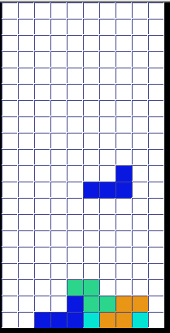

# Tetris

This project is a small simulation of the original 1984 version of the Tetris game, implemented in C++.

## Requirements

- Windows 10 operating system
- Visual Studio 2017 for building the project

## Usage

1. Clone or download the project to your local machine.
2. Open the project in Visual Studio 2017.
3. Build the project to generate the executable.
4. Run the executable to start the Tetris game.

## License

This project is open-source and is released under the Creative Commons Non-Commercial License. You are free to use the source code for non-commercial purposes.

## Gameplay and Additional Features

The gameplay follows the rules of the classical Tetris game:

- Use the up arrow key to rotate a shape.
- Use the left arrow key to move the shape to the left.
- Use the right arrow key to move the shape to the right.
- Use the down arrow key to drop the current shape immediately.

Additionally, the game includes the following features:

- The game consists of five levels, and the speed of the game increases with each level.

Enjoy playing Tetris!
